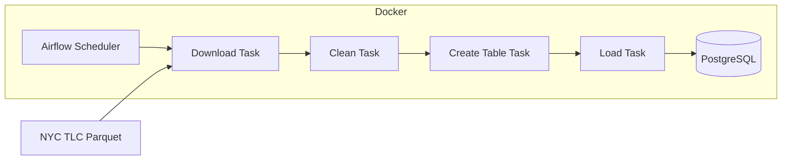

# Airflow Postgres ETL

A local-execution ETL pipeline orchestrated with **Apache Airflow** via **Docker Compose**. The workflow (DAG) extracts public **NYC Green Taxi** trip records in Parquet format, processes and filters the information using **Pandas**, and persists the transformed data into a **PostgreSQL** database.

## Architecture



The DAG follows a strict linear sequence — no task starts until the previous one finishes successfully:

**Download → Clean → Create Table → Load**

## Tech Stack

| Component    | Technology                                    |
|--------------|-----------------------------------------------|
| Orchestration| Apache Airflow 3.2.2 (LocalExecutor)          |
| Runtime      | Docker + Docker Compose                       |
| Database     | PostgreSQL 15                                 |
| Data processing | Python + Pandas + PyArrow                   |

## Repository Structure

```
airflow-postgres-etl/
├── compose.yml                  # Airflow 3 + PostgreSQL stack
├── dags/
│   └── taxi_etl_dag.py          # The ETL DAG definition
├── sql/
│   └── create_table__green_tripdata.sql
├── datasets/                    # Local raw files (gitignored)
├── logs/                        # Airflow logs (gitignored)
└── plugins/                     # Airflow plugins mount
```

## Core Functionality

The `taxi_data_etl` DAG defines four tasks:

1. **download_green_taxi_parquet** — Downloads a Green Taxi Parquet file from NYC TLC.
2. **clean_data_task** — Filters rows using Pandas according to data quality rules.
3. **create_table_task** — Ensures the target table exists in PostgreSQL.
4. **insert_data_task** — Appends the cleaned records into the database.

## Quick Start

See the [setup guide](docs/setup.md) for full installation instructions.

```bash
# 1. Create required folders
mkdir -p ./dags ./logs ./plugins

# 2. Set the Airflow user ID
echo "AIRFLOW_UID=$(id -u)" > .env

# 3. Start the stack
docker compose up -d
```

Open the Airflow UI at **http://localhost:8080** (credentials `admin` / `admin`).

## Key Files

| File                                     | Purpose                                    |
|------------------------------------------|--------------------------------------------|
| `compose.yml`                            | Airflow 3 + PostgreSQL orchestration       |
| `dags/taxi_etl_dag.py`                   | ETL DAG definition and task logic          |
| `sql/create_table__green_tripdata.sql`   | DDL for the destination table              |

## Documentation

- [Setup & First Run](docs/setup.md)
- [DAG Reference](docs/dag.md)
- [Data Pipeline (ETL)](docs/data-pipeline.md)
- [Database Schema](docs/database-schema.md)
- [Troubleshooting](docs/troubleshooting.md)